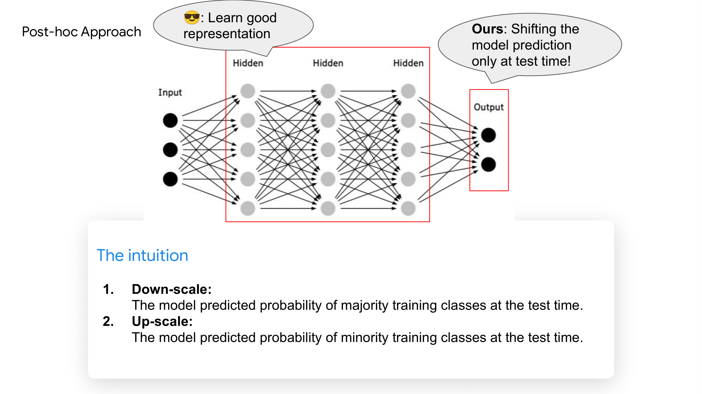

## Distributionally Robust Post-hoc Classifiers under Prior Shifts [ICLR 2023]

This repository is the official Pytorch implementation of [[Distributionally Robust Post-hoc Classifiers under Prior Shifts]](https://openreview.net/forum?id=3KUfbI9_DQE)) accepted by ICLR 2023.

<b>Title</b>: <i>Distributionally Robust Post-hoc Classifiers under Prior Shifts</i> <a href="https://openreview.net/forum?id=3KUfbI9_DQE">[pdf]</a>\
<b>Authors</b>:Jiaheng Wei, Harikrishna Narasimhan, Ehsan Amid, Wensheng Chu, Yang Liu, Abhishek Kumar\
<b>Institute</b>: University of California, Santa Cruz \& Google Research\
<b>One sentence summary</b>: We propose a method for scaling the model predictions at test-time for improved distribution robustness to prior shifts.

<b>Motivation 1:</b>\
How a method performs well under a generic evaluation metric:

When the target distribution r is a uniform vector, such metric covers the mean accuracy and worst accuracy as two extremes.

<b>Motivation 2:</b>\
Deep neural nets could capture represenrations well, we could inherit the learned nice representation and introduce a post-hoc approach to achieve model robustness under prior shifts.

An example is given as follows:

<b>Drops:</b>\
We propose a Distributionally RObust PoSt-hoc method (DROPS), which enablesthe reuse of a pre-trained model for different robustness requirements by simply scaling the modelpredictions. Drops obtains the optimal per-class/group weights for scaling through maximizing the delta-worst accuracy.

<b>Experiments:</b>\
A special case of prior shift is the Class-imbalanced learning.
The code of Drops w.r.t. imbalanced CIFAR-10 and CIFAR-100 datasets will be released soon!

<b>Cite Drops</b>\
If you find the code useful in your research, please consider citing our paper:

<pre>
@inproceedings{
wei2023distributionally,
title={Distributionally Robust Post-hoc Classifiers under Prior Shifts},
author={Jiaheng Wei and Harikrishna Narasimhan and Ehsan Amid and Wen-Sheng Chu and Yang Liu and Abhishek Kumar},
booktitle={International Conference on Learning Representations},
year={2023},
url={https://openreview.net/forum?id=3KUfbI9_DQE}
}</pre>
